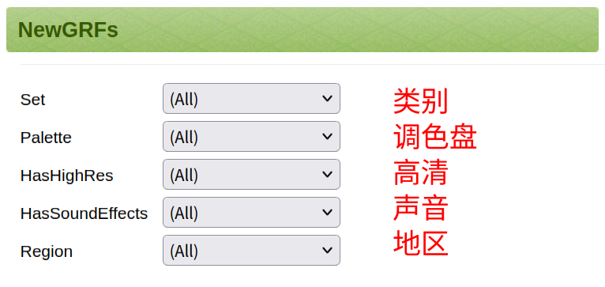

# 查找扩展

```{note}
部分基于 Zyliety 于[哔哩哔哩](https://space.bilibili.com/359135733/)发布的 NewGRF 系列专栏。 \
原作者：Zyliety \
原标题：newgrf 一览 \
原链接：<https://www.bilibili.com/read/readlist/rl743422>
```

## 前言

OpenTTD 有许多扩展可用，包括：

- Baseset
  - 基本图形集
  - 基本音乐集
  - 基本音效集
- NewGRF（游戏中的主要拓展）
- 游戏脚本（Game Script, GS）
- AI

```{mermaid}
flowchart TD
  扩展 --- 基础集
  基础集 --- 图形
  基础集 --- 音乐
  基础集 --- 声音
  扩展 --- NewGRF
  扩展 --- 脚本
  脚本 --- 游戏脚本
  脚本 --- AI
  NewGRF ---- 车辆[公路车辆\n火车\n飞机\n船舶]
  NewGRF ---- 基础设施[房屋\n车站\n铁路和道路]
  NewGRF --- 工业
  NewGRF --- 图形替换
```

## BaNaNaS

BaNaNaS 是一个在线内容托管服务，由 OpenTTD 官方团队维护。有相当一部分拓展托管在 BaNaNaS 上。
**由于所有人都可以自由上传内容至服务器上，请务必做好内容辨析。**

BaNaNaS 的网址是 <https://bananas.openttd.org>

### 查找 NewGRF

BaNaNaS 提供了便利的查找功能。在 [NewGRF 页面](https://bananas.openttd.org/package/newgrf) 中
有五个筛选器，分别是：



<!-- markdownlint-disable-next-line -->
<iframe width="100%" height="400px" src="https://bananas.openttd.org/package/newgrf?" frameborder="yes" framespacing="1"></iframe>

<!-- markdownlint-disable-next-line -->
<p style="text-align: center;">你可以现在就试试！</p>

## TT-Forums

TT-Forums 是早期 NewGRF 的集散地，也是 OpenTTD 开发论坛（之一）。你可以在 Graphics-developments 或 Graphics-releases 板块下找到 NewGRF。

开发：<https://www.tt-forums.net/viewforum.php?f=26>
发布：<https://www.tt-forums.net/viewforum.php?f=67>

<!-- markdownlint-disable-next-line -->
<iframe width="100%" height="400px" src="https://www.tt-forums.net/viewforum.php?f=26" frameborder="yes" framespacing="1"></iframe>

## OpenTTDCoop

OpenTTDCoop 是一个致力于 OpenTTD 合作游戏的社区，
主要专注于设计高效运输与逻辑系统。
你可以在 OpenTTDCoop 上找到一些 GRF。

<http://wiki.openttdcoop.org/GRF>（GRF）\
<https://bundles.openttdcoop.org/>（GRF Bundles）\
<http://wiki.openttdcoop.org/GRF_Table>（GRF Table）

### TELKLAND

TELKLAND 是一个韩语 OpenTTD 社区。

<https://telk.kr>

### Michael Blunck

<http://ttdpatch.de/download.html>

### GRFCrawler

<https://grfcrawler.tt-forums.net/>

### Simuscape

<http://www.simuscape.net/simutalk/index.php>

### Andythenorth

<https://grf.farm>

- <http://www.as-st.com/ttd/>
